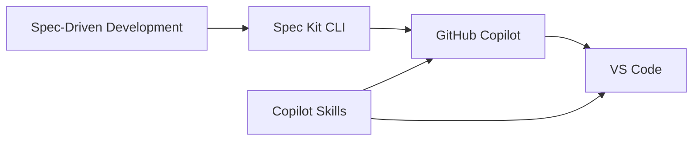

<!--
 @AI-Generated: true
 @AI-Model: GitHub Copilot
 @Summary: 累计AI新增39行/修改0行/删除0行; 总行数39行
 @AI-LastModified: 2026-04-24 17:42:39
-->

---
title: AI 编程培训知识库综述
created: 2026-04-14
updated: 2026-04-28
tags: [AI编程, 培训, 综述]
sources: [spec-kit-cli培训文档.md, vscode-copilot-skills-training-9568667871.md, Superpowers技能培训课堂讲义.md, Superpowers技能链实操跟练手册.md, LLM-Wiki培训手册.md]
type: overview
---

# AI 编程培训知识库综述

本 Wiki 是关于 **AI 编程（AI-Assisted Programming）培训** 的结构化知识库，涵盖 AI 辅助开发工具链、方法论和最佳实践。

---

## 知识库范围

### 已覆盖领域

- **AI 辅助开发方法论**：[[concepts/spec-driven-development|Spec-Driven Development（规格驱动开发）]]，将软件开发标准化为以规格为中心的工作流
- **AI 技能包标准**：[[concepts/copilot-skills|Copilot Skills]]，开放标准的 AI 技能包机制，支持渐进式披露和自动触发
- **AI 代理流程技能体系**：[[concepts/superpowers-skills|Superpowers 技能体系]]，覆盖从需求澄清到开发收尾的流程化技能链
- **开发工具链**：[[entities/spec-kit-cli|Spec Kit CLI]]、[[entities/github-copilot|GitHub Copilot]]、[[entities/vscode|VS Code]]

### 待覆盖领域

- Prompt Engineering（提示工程）技巧与模式
- Agent 模式与 MCP 协议
- AI 代码审查与质量保障
- 更多 AI 编程工具对比与实操案例

---

## 知识图谱

---

## 当前状态

已摄入 **5 个源文件**，累计生成 **13 个核心 Wiki 页面**（5 摘要 + 3 概念 + 4 实体 + 1 综述，不含专题与日志索引）。知识库已覆盖 AI 辅助开发方法论、Skills 标准、Superpowers 技能链、Wiki 建设方法与关键工具平台。

---

## 使用方式

1. **摄入**：将源文件放入 `raw/` 目录，告诉 LLM "请摄入 raw/xxx"
2. **查询**：直接提问
3. **维护**：要求 LLM 执行 `lint` 检查 Wiki 健康度
